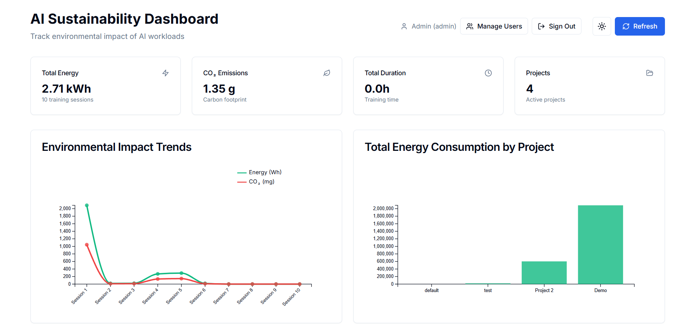

# AI Impact Tracker 🌱

A simple CLI tool to track the environmental impact of your AI training runs, with an optional dashboard for visualizing trends and analytics.



> **Dashboard Screenshot Note**: The data shown in the dashboard image above is sample/demo data only. 

> **Important**: This tool provides basic environmental impact estimates for awareness and overview purposes only. It is **not intended for regulatory compliance, carbon accounting, or official reporting**. For precise measurements or compliance requirements, please use specialized tools and consult environmental experts.

## Quick Start

```bash
# 1. Install
npm install -g https://github.com/emmyme/ai-impact-tracker

# 2. Track your training
ai-impact-tracker python train.py
```

That's it! The tool will show you:
- Energy consumption (kWh)
- CO2 emissions (grams)
- Training duration

For visual analytics and team collaboration, you can also generate a full dashboard (see below).

## Optional Dashboard

Want to see charts and trends?

```bash
# Create a dashboard
ai-impact-tracker create my-dashboard
cd my-dashboard && npm install && npm run dev

# Then track with dashboard storage
ai-impact-tracker python train.py
```


### Dashboard Features

- **Visual Analytics**: Interactive charts showing energy and emissions trends over time
- **Project Comparison**: Compare environmental impact across different AI projects
- **Session History**: Detailed logs of all training sessions with precise metrics
- **User Management**: Role-based access control for teams
- **Dark Mode**: Modern UI with light/dark theme support
- **Real-time Updates**: Metrics appear automatically as you run training sessions

The dashboard provides a comprehensive view of your AI environmental impact with:
- Energy consumption trends
- CO2 emissions over time
- Project-by-project comparisons
- Training duration analytics
- Export capabilities for further analysis

## CLI Options

```bash
ai-impact-tracker python train.py --project "my-model" --team "research"
```

- `--project <name>` - Project name for organization
- `--team <name>` - Team name
- `--environment <env>` - Environment (development/staging/production)

## How It Works

1. Wraps your Python script with environmental tracking
2. Uses CodeCarbon to measure actual energy consumption
3. Calculates CO2 emissions based on your location's power grid
4. Shows results in terminal and optionally saves to dashboard

## What's Tracked

- **Energy**: Real measurements from your CPU/GPU usage
- **CO2**: Calculated from energy consumption and grid carbon intensity
- **Duration**: How long your training took
- **No Water Usage**: Local machines don't use water for cooling

## Limitations & Disclaimers

- **Good for**: Awareness, comparing models, understanding impact trends
- **Not for**: Regulatory compliance, official carbon reporting, precise accounting
- **Local only**: Designed for personal computers, not cloud/datacenter training
- **Estimates**: Results vary by hardware, location, and grid conditions

## Technical Details

- Uses [CodeCarbon](https://codecarbon.io/) for energy measurement
- Uses [CarbonTracker](https://carbontracker.info/) for detailed logging
- Automatically installs required dependencies
- Works with any Python AI framework (PyTorch, TensorFlow, etc.)

## License

MIT License - see [LICENSE](LICENSE) for details.

## Acknowledgments

This project is built with and depends on these tools:

- **[CodeCarbon](https://codecarbon.io/)** - Energy consumption measurement
- **[CarbonTracker](https://carbontracker.info/)** - Detailed carbon footprint logging
- **[Next.js](https://nextjs.org/)** - React framework for the dashboard
- **[FastAPI](https://fastapi.tiangolo.com/)** - Modern Python web framework
- **[Commander.js](https://github.com/tj/commander.js/)** - Node.js command-line interfaces
- **[Tailwind CSS](https://tailwindcss.com/)** - Utility-first CSS framework
- **[shadcn/ui](https://ui.shadcn.com/)** - Beautiful UI components
- **[D3.js](https://d3js.org/)** - Data visualization library

---

**Built for AI environmental awareness** 

